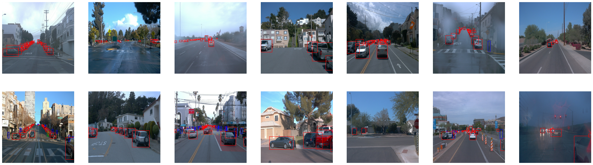
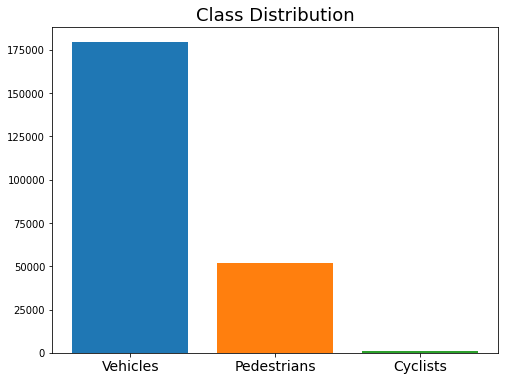
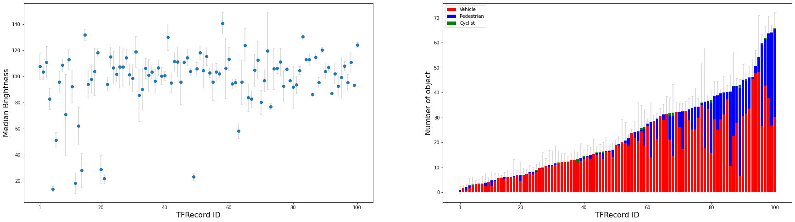

### Project overview
Object detection is one of the most important tasks of self-driving cars which are required to understand sorrounding environments and properly navigate with safety.

In this project, I try to train a model which detects typical traffic participants, namely vehicles, pdestrians and cyclists, from images taken in a variety of environments. Starting with a pre-trained model, I experiment with some hyper parameters and image augmentations to examine how they affect the model performance.

It is a critical step of training a ML model to sufficiently understand data to be used. Therefore I perform a thorough EDA in advance of the training.

### Set up
<!-- This section should contain a brief description of the steps to follow to run the code for this repository. -->
Here is a set up instruction to run the code in this repository.

1. Build the docker image with:
```
docker build -t <IMAGE NAME> -f Docker file .
```
2. Create a container with:
```
 docker run --shm-size=<ALLOCATED MEMORY SIZE> --gpus all -v <PATH TO LOCAL PROJECT FOLDER>:/app/project/ --network=host -it <IMAGE NAME> bash
```
(Hereafter, you are in the container)

3. Download and process the data:
```
python download_process.py --data_dir /app/project/data/processed/ --temp_dir /app/project/data/raw/
```
4. Create splits:
```
python create_splits.py --data_dir app/project/data/
```
5. Training:
```
python model_main_tf2.py --model_dir=/app/project/training/reference/ --pipeline_config_path=/app/project/training/reference/pipeline_new.config
```
6. Evaluation:
```
python model_main_tf2.py --model_dir=/app/project/training/reference/ --pipeline_config_path=/app/project/training/reference/pipeline_new.config --checkpoint_dir=/app/project/training/reference/
```
7. Monitor the processses with TensorBoard:
```
tensorboard --logdir=training
```

### Dataset
Here I summarize my findings about the dataset as a result of EDA. Then I introduce a strategy to split the entire dataset into three subsets for training, validation and test. Please see `Exploratory Data Analysis.ipynb` for details.
#### Dataset analysis
1. Images contained the dataset

The figure below shows 14 images randomly selected from the dataset. It is clear that they were taken in a variety of environments in terms of time, weather, traffic density and so on.


2. Class distribution

There are three classes in the dataset, namely Vehicles, Pedestrians and Cyclists. It is important to know class distribution over the dataset to come up with a good strategy for splitting.

Counting the number of each class contained in 10,000 images, I find that 77% of objects in the dataset are labeld as Vehicles, while Cyclists class occupy less than 1% of the total as shown in the figure below. We shoud be cautious about this class imbalance when splitting the data into subsets. 


#### Cross validation
Keeping the above finding in mind, I try to carefully split the dataset to the subsets so that the ratio of the number of classes remains as unchanged as possible. As the dataset consists of 100 TFRecord files, I count the number of objects in each record and assign it to one of the splits.

The right panel in the below figure shows the number of objects contained in each tfrecord. Note that most of the records do not contain any objects labeld as Cyclists, and that Pedestrians class obviously tends to appear in dense environments.  


### Training
#### Reference experiment
This section should detail the results of the reference experiment. It should includes training metrics and a detailed explanation of the algorithm's performances.

#### Improve on the reference