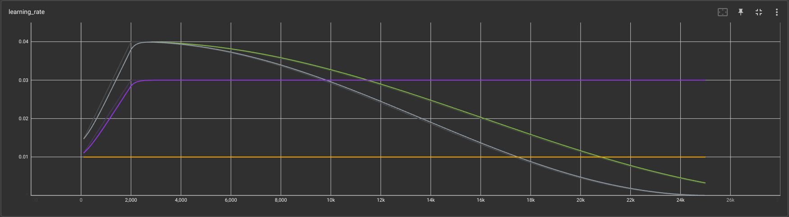

### Project overview
Object detection is one of the most important tasks of self-driving cars which are required to understand sorrounding environments and properly navigate with safety.

In this project, I try to train a model which detects typical traffic participants, namely vehicles, pdestrians and cyclists, from images taken in a variety of environments. Starting with a pre-trained model, I experiment with some hyper parameters and image augmentations to examine how they affect the model performance.

It is a critical step of training a ML model to sufficiently understand data to be used. Therefore I perform a thorough EDA in advance of the training.

### Set up
<!-- This section should contain a brief description of the steps to follow to run the code for this repository. -->
Here is a set up instruction to run the code in this repository.

1. Build the docker image with:
```
docker build -t <IMAGE NAME> -f Docker file .
```
2. Create a container with:
```
 docker run --shm-size=<ALLOCATED MEMORY SIZE> --gpus all -v <PATH TO LOCAL PROJECT FOLDER>:/app/project/ --network=host -it <IMAGE NAME> bash
```
(Hereafter, you are in the container)

3. Download and process the data:
```
python download_process.py --data_dir /app/project/data/processed/ --temp_dir /app/project/data/raw/
```
4. Create splits:
```
python create_splits.py --data_dir app/project/data/
```
5. Training:
```
python model_main_tf2.py --model_dir=/app/project/training/reference/ --pipeline_config_path=/app/project/training/reference/pipeline_new.config
```
6. Evaluation:
```
python model_main_tf2.py --model_dir=/app/project/training/reference/ --pipeline_config_path=/app/project/training/reference/pipeline_new.config --checkpoint_dir=/app/project/training/reference/
```
7. Monitor the processses with TensorBoard:
```
tensorboard --logdir=training
```

### Dataset
Here I summarize my findings about the dataset as a result of EDA. Then I introduce a strategy to split the entire dataset into three subsets for training, validation and test. Please see `Exploratory Data Analysis.ipynb` for details.
#### Dataset analysis
1. Images contained the dataset

The figure below shows 14 images randomly selected from the dataset. It is clear that they were taken in a variety of environments in terms of time, weather, traffic density and so on.


2. Class distribution

There are three classes in the dataset, namely Vehicles, Pedestrians and Cyclists. It is important to know class distribution over the dataset to come up with a good strategy for splitting.

Counting the number of each class contained in 10,000 images, I find that 77% of objects in the dataset are labeld as Vehicles, while Cyclists class occupy less than 1% of the total as shown in the figure below. We shoud be cautious about this class imbalance when splitting the data into subsets. 


#### Cross validation
Keeping the above finding in mind, I try to carefully split the dataset to the subsets so that the ratio of the number of classes remains as unchanged as possible. As the dataset consists of 100 TFRecord files, I count the number of objects in each record and assign it to one of the splits.

The right panel in the below figure shows the number of objects contained in each tfrecord. Note that most of the records do not contain any objects labeld as Cyclists, and that Pedestrians class obviously tends to appear in dense environments.  


### Training
In this section, I introduce the model trainning and its performance. COCO detection metrics is adopted to evaluate performance of the detector. mAP in the COCO detection metrics is calculated by averaging mAPs over 10 IoU thresholds (0.50, 0.55, ..., 0.95). mAPs for objects with specific sizes (large, medium and small) are also calculatled during the validation step.
Please refer to the following links for detailed information about the metrics.

- https://cocodataset.org/#detection-eval
- https://blog.zenggyu.com/en/post/2018-12-16/an-introduction-to-evaluation-metrics-for-object-detection/

#### Reference experiment
Following figure shows the learning curve of the base model over 25,000 steps. Gray and green lines represent the training loss and validation loss, respectively.


mAP of the base model is 0.132. As expected, mAP significantly varies with the size of objects. There are many extremely small objects in the dataset which even human are hardly able to detect. Therefore mAP over the entire objects is small regardless of quite better peformances against the larger objects.


#### Improve on the reference
To improve performance of the base model, I examine effects of learning rate and image augmentation.

1. Learning rate

When trainning the base model, cosine decay learning rate with the peak value of 0.04 was used. I use different learning rates to understand how they affect the learning curve.
Here are the learning rates adopted:
- Cosine decay with a longer duration (light green)
- Constant learning rate of 0.03 following warmup (purple)
- Constant learning rate of 0.01 (yellow)



As shown in the fogire below, impact of the use of different learning rates on the learning curve is insignificant. Therefore I continue using the same configuration as the base model in the following analysis.


2. Image augmentation

Image augmentation has been known as a good way to make ML models more robust against variations of data. During the trainning of the base model, random_horizongal_flip and random_crop_image augmentations were used.

Here I add random_rgb_to_gray augmentation to the configuration for the base model, which change the color scale of images from RGB to gray scale with a probability of 0.2. With this augmentation, the learning curve changes as shown below, where the trainning and validation loss obtained with augmented images are represented by cyan and magenta lines, respectively.


Validation loss is lower in the mode with augmented images while convergence of the training loss is similar to that of the base model.

Consequently, mAP is improved by 40% with the image augmentation as shown in the following figures. This suggests that the added augmentation has reduced dependency of the model on object's colors.


Other than the above, I have investigated effects of different image augmentations as summarized in `Explore augmentations.ipynb`. However, I can't see further peformance improvements compared to the model introduced here. This is probably because the complexity of object detection tasks, where one image can contain multiple target with different class, size, appearance and so on, as opposed to classification problems. It is difficult to accurately predict how each augmentation affect the model performance.
